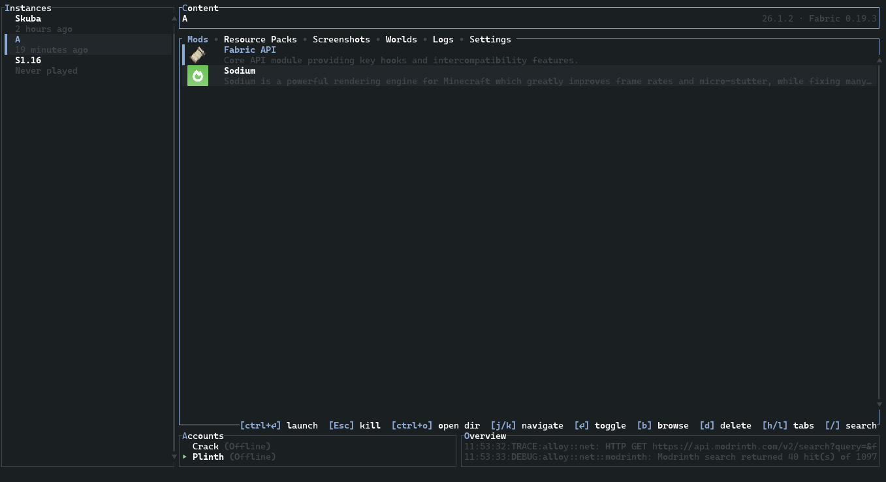
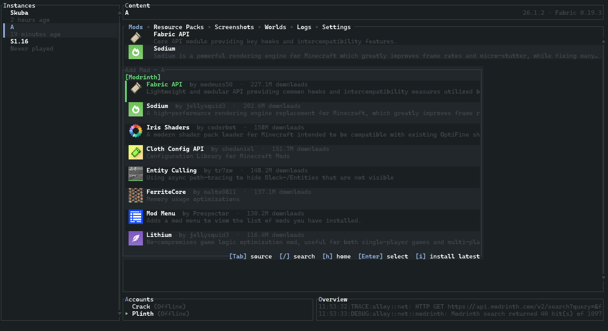

<p align="center">
  
</p>

<h1 align="center">alloy</h1>

<p align="center"><em>A Minecraft launcher. Minimal but featureful.</em></p>

## Install

Linux/macOS:

```sh
curl -fsSL https://raw.githubusercontent.com/plinthlol/alloy/HEAD/assets/install.sh | bash
```

Windows (PowerShell):

```powershell
irm https://raw.githubusercontent.com/plinthlol/alloy/HEAD/assets/install.ps1 | iex
```

Or grab a prebuilt binary from [Releases](https://github.com/plinthlol/alloy/releases).

## Screenshots

<p align="center">
  
</p>

<p align="center">
  
</p>

## Usage

```sh
alloysh
```

Navigate with `j`/`k`, manage accounts with `A`, play with `Ctrl+Enter`.

## Build

```sh
cargo build --release   # needs Rust (2024 edition) and a JDK
```

## License

GPL-3.0

---

This `tui` branch is a fork of [rmcl](https://github.com/objz/rmcl) by [objz](https://github.com/objz). Huge thanks to him for building the foundation that this branch is built on.
